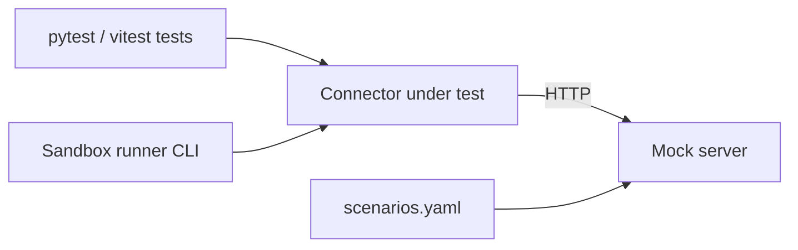

# Connector Sandbox: Status Report

> **Point-in-time snapshot (28 Sep 2026, v0.3.0).** These are the results of the first clean run. For the current list of gaps and decisions see [KNOWN_GAPS.md](KNOWN_GAPS.md); for how to use the sandbox see the [README](../README.md).

**Version:** 0.3.0 (combined Python + TypeScript) · **Report date:** 28 Sep 2026
**Status:** Runs green from a clean checkout. 52 of 52 tests pass. Several known gaps remain (section 8).

---

## 1. Summary

The sandbox lets a connector author test a connector against a fake vendor API, with no real credentials and no real network calls. It has two halves that run from one folder with one command:

| Half | What it provides | Result on first clean run |
|---|---|---|
| **Python** | FastAPI mock server with 8 switchable scenarios, a reference connector, a CLI runner, pytest suite | **39 passed**, 19.4 s |
| **TypeScript** | Reusable contract suite (`runContractSuite`), in-process mock server, sample connector, vitest suite | typecheck clean, **13 passed**, 0.8 s |

**What is solid:** the Python failure scenarios (401, 403, 429, 500, timeout, empty, malformed) are exercised end to end through a real HTTP socket, and the clean-environment install works (verified by the team on Windows, Python 3.12.7, Node with vitest 2.1.9).

**What is not finished:** the TypeScript mock server has no failure scenarios, the mock server never validates credentials, the Python side has no reusable contract suite, and the two SDKs used by the sandbox are older than the SDK in the `aev-pod-delta` repo. These are the top items in section 8.

---

## 2. How it fits together



- The **connector under test** talks to a URL, exactly as it would to a real vendor. The only difference is that the URL points at `127.0.0.1`.
- The **mock server** decides what to return. In Python the behaviour is chosen per request with `?scenario=<name>`. In TypeScript it serves fixed JSON per route.
- Tests either call connector methods directly (raw behaviour) or call `sync()` (behaviour wrapped by the SDK's error handling). Both matter, and section 7 explains why.

### Folder layout

```
connector-sandbox/
├── run_all.ps1 / run_all.sh     one command runs everything
├── README.md
├── python/
│   ├── mock_server/server.py    GET /health, GET /api/assets?scenario=<name>
│   ├── scenarios/               scenarios.yaml + loader
│   ├── connector_sdk/           vendored Python SDK (Week-1 contract)
│   ├── connectors/reference/    the example connector under test
│   ├── sandbox/runner.py        CLI entry point
│   ├── conftest.py              api_client and live_server fixtures
│   └── tests/                   4 test files, 39 tests
└── ts/
    ├── src/                     connector.ts, models.ts (zod), sampleConnector.ts
    ├── src/testing/             contractHarness.ts, mockServer.ts, mockData.ts
    ├── tests/                   sample.contract.test.ts, mockServer.test.ts, template
    └── docs/CONNECTOR_GUIDE.md
```

---

## 3. Running it

**Prerequisites:** Python 3.12+, Node 20+, network access on first run (to install packages).

```powershell
cd connector-sandbox
.\run_all.ps1              # python tests, then TS typecheck + tests
.\run_all.ps1 -PythonOnly
.\run_all.ps1 -TsOnly
.\run_all.ps1 -Serve       # start the mock server on http://127.0.0.1:8080
```

If PowerShell blocks the script: `Set-ExecutionPolicy -Scope Process Bypass`. On macOS, Linux or Git Bash use `./run_all.sh` with `--python-only`, `--ts-only` or `--serve`.

**Trying scenarios by hand** (two terminals):

```powershell
uvicorn mock_server.server:app --port 8080          # terminal 1, from python\
python -m sandbox.runner --scenario success          # terminal 2
python -m sandbox.runner --scenario server_error     # exit code 1
```

The runner exits `0` only when the sync status is `SUCCESS`, so it can be used in CI.

---

## 4. Verified results

Source: the run of `run_all.ps1` on a clean folder on Windows. Nothing below is inferred.

| Item | Value |
|---|---|
| Python / pytest | 3.12.7 / 9.1.1 |
| Python tests | 39 collected, 39 passed, 19.42 s |
| TS install | 48 packages, 24 s |
| TS typecheck | `tsc --noEmit`, no errors |
| TS tests | 13 passed in 2 files, 836 ms |

**Python tests by file:** `test_mock_server` 11, `test_reference_connector` 19, `test_runner_cli` 5, `test_scenario_loader` 4.
**TS tests by file:** `mockServer.test.ts` 3, `sample.contract.test.ts` 10 (7 contract checks + 3 behaviour checks).

**Two observations from the run:**

1. `StarletteDeprecationWarning`: using `httpx` with `starlette.testclient` is deprecated in favour of `httpx2`. Harmless today; plan to revisit when FastAPI drops support.
2. The Python suite takes about 19 s because `live_server` starts a fresh uvicorn per test and the three timeout tests each wait about 2 s. Making the fixture session-scoped would cut this substantially.

**A passing test that means "bug still present":** `mockServer.test.ts` contains one `it.fails` test asserting that `/assets?limit=10` returns 200. It currently returns 404 (section 8), so vitest counts the test as passed. When `mockServer.ts` is fixed, that test will go red and must be converted to a normal `it`.

---

## 5. Scenario catalogue (Python mock server)

Select with `GET /api/assets?scenario=<name>`. Unknown names return 400. `/health` is always 200.

| Scenario | HTTP status | What the server does | What the connector does today |
|---|---|---|---|
| `success` (default) | 200 | Two well-formed assets | `SUCCESS`, 2 discovered, 2 pushed |
| `empty` | 200 | `{"assets": []}` | `SUCCESS`, 0 discovered; `ingest()` is skipped |
| `malformed` | 200 | One asset missing `name`, one with unknown `type` | `discover()` raises `KeyError` directly; `sync()` reports `FAILED` |
| `unauthorized` | 401 | Error status | `httpx.HTTPStatusError` directly; `sync()` reports `FAILED` |
| `forbidden` | 403 | Error status | same as above |
| `rate_limited` | 429 | Error status (no `Retry-After`) | same; **no retry or backoff exists** |
| `server_error` | 500 | Error status | same |
| `timeout` | 200 after 2 s | Delays the response | `httpx.TimeoutException` when client timeout is shorter; `sync()` reports `FAILED` |

Adding a scenario means adding an entry to `scenarios/scenarios.yaml` (`status_code`, optional `delay_seconds`) and, if it needs a special body, a branch in `mock_server/server.py`.

---

## 6. Checklist scorecard

Legend: ✅ met and evidenced · ⚠️ partly met · ❌ not met.

### Python sandbox

| Item | Status | Evidence / note |
|---|---|---|
| Mock API server starts | ✅ | Started 23 times in the run via `live_server` (18 connector tests + 5 runner tests) |
| Stops cleanly | ✅ | Teardown joins the thread; suite finished with no hang. No explicit assertion |
| Connector can connect | ✅ | `test_full_sync_succeeds_on_the_success_scenario` |
| No real vendor API calls | ✅ | By design: only `127.0.0.1` |
| No real credentials required | ✅ | Fixed dummy key |
| **Authentication can be mocked** | ❌ | Server never reads the `Authorization` header; a wrong key behaves like a right one. `unauthorized` is just a query switch |
| Successful / empty response | ✅ | Both scenarios tested |
| Malformed response handled | ⚠️ | Handled only by `sync()`'s catch-all; `discover()` raises a raw `KeyError` |
| 401 / 403 / 429 / 500 handled | ✅ | Surface as `FAILED`. 429 has no retry logic |
| Timeout handled | ✅ | Client timeout of 0.3 s against a 2 s delay |

### Connector contract

| Item | Status | Note |
|---|---|---|
| Satisfies Python ABC | ⚠️ | Instantiates and runs; no explicit ABC assertion |
| Required methods exist / signatures match | ⚠️ | Correct by reading; Python has no generic contract suite to assert it |
| Expected models used | ✅ | `Asset`, `AssetType`, `SyncResult` |
| Discovery / ingestion tested | ✅ | Ingestion is in-memory only for the reference connector |
| Normalization tested | ⚠️ | Checks `source`, `type`, `raw`; not every field mapping |
| **Invalid connector fails clearly** | ❌ | No test that a subclass missing an abstract method is rejected |

### Test harness

| Item | Status | Note |
|---|---|---|
| pytest runs from clean environment | ✅ | Verified on a fresh `.venv` (Windows). Linux and macOS not yet verified |
| Fixtures isolated | ✅ | Function-scoped server on an OS-assigned port |
| Mock data easy to modify | ⚠️ | Data is hardcoded in `server.py`; `fixtures/` folder is unused |
| New connector can copy template | ⚠️ | TS has an explicit template; Python's de-facto template is `test_reference_connector.py`, undocumented |
| Success and failure cases included | ✅ Python / ❌ TS | TS mock server cannot produce failures |
| Setup/teardown automated | ✅ | |
| No manual vendor setup | ✅ | |
| Documentation explains how to run | ✅ | Top-level README and this document. `python/README.md` is still empty |

### SDK parity

| Item | Status | Note |
|---|---|---|
| Python ABC is the contract source | ⚠️ | Which ABC is unresolved (section 9, decision 1) |
| Sandbox uses the Python contract | ✅ | Vendored copy |
| TS matches Python method for method | ✅ | All 6 methods; verified by compiling and running `SampleConnector` |
| Model alignment (Python ↔ TS/zod) | ⚠️ | Core models aligned (snake_case). TS guide and mock data still camelCase |
| No Python-only behaviour required | ⚠️ | The contract suite requires `name != "unnamed"`, which the contract itself does not state |
| No TS-only API without discussion | ⚠️ | `durationSeconds()` (a free function, Python has a property), `AssetTypeSchema`, `JsonSchemaLike` need to be recorded as accepted differences |

---

## 7. What the tests taught us about the reference connector

These are behaviours the suite now pins down. They are current behaviour, not necessarily desired behaviour.

1. **Direct calls and `sync()` behave differently.** `discover()` raises on any HTTP error or bad payload. `sync()` catches everything and reports `FAILED` with a message like `discover() failed: ...`. A generic contract test that only calls methods directly would never notice a connector that only works when wrapped.
2. **An empty result is a success**, and `ingest()` is not called at all.
3. **The connector does no payload validation.** It indexes `item["name"]` directly, so any field a vendor omits becomes a `KeyError`. A vendor sending a new `type` value would raise `ValueError`.
4. **No retry, backoff or `Retry-After` handling** for 429.
5. **`check_health()` is the only method that catches HTTP errors itself.**
6. **`PARTIAL` cannot occur in the default `sync()`.** Errors are recorded only when `discover()` or `ingest()` raises, and `assets_pushed` is 0 in both cases.
7. **The runner does not route scenarios by itself.** The connector must forward the scenario as a query parameter (`extra_params`), otherwise every run hits `success`. New connectors need the same hook.

---

## 8. Known gaps and risks, in priority order

### P0: correctness of the contract

| # | Gap | Why it matters | Fix |
|---|---|---|---|
| 1 | **Two different SDKs.** The sandbox vendors the Week-1 SDK (pydantic, sync `sync()`, `finished_at`, `discovered_at`). The repo's `connector-sdk-v0.1.0` uses dataclasses, **async** `sync()`, `completed_at`, `discoveredAt`, `(config, credentials)` constructors, name-regex validation and `ContractViolation` | Connectors written to the repo SDK (for example `elastic_connector`) cannot run in this sandbox unchanged | Decide the canonical SDK (decision 1), then align both sandboxes and the guide |
| 2 | **TS guide and mock data still use camelCase** (`apiKey`, `assetsDiscovered`, `startedAt`) | The guide's `SyncResult.parse` example throws against the snake_case models. `apiKey` differs from Python's `api_key`, which is a secret-store lookup key | Rewrite the guide examples and `MOCK_CREDENTIALS` |
| 3 | **`describeConfig()` / `describeCredentials()` shape is not asserted.** Python returns a `{type, properties, required}` schema; the TS guide shows a flat map with `required: true` per field | Drift can happen silently, and already did once | Add schema-shape assertions to both contract suites |

### P1: test coverage

| # | Gap | Fix |
|---|---|---|
| 4 | **Mock server does not validate credentials** | Return 401 for a missing or wrong `Authorization` header, keep `?scenario=unauthorized` as an override |
| 5 | **TS `MockApiServer` is too thin.** Verified: `/assets?limit=10` returns 404 (matches on the raw URL); `POST /assets` returns 200 (method ignored); wrong or missing auth returns 200; no request recording; no failure scenarios | Strip the query string, check method, record requests, allow per-route status, delay and body |
| 6 | **Python has no reusable contract suite.** The generic suite from the earlier harness did not carry into v3 | Provide a parametrized `contract_suite(make_connector)` |
| 7 | **Contract suites are shallow** (both sides). `discover()` only checks the type of the result; `ingest()` would accept `NaN` in TS | Validate each asset, check `source == name`, unique ids, integer non-negative counts |
| 8 | **No test that an invalid connector is rejected** | Add a subclass missing a method and assert instantiation fails |

### P2: hygiene

- `live_server` is per-test; use session scope to cut runtime.
- `fixtures/reference/success/assets.json` is unused and duplicates data hardcoded in `server.py`.
- Only Windows verified; run once on Linux and macOS.
- `python/README.md` is empty.
- `vitest.config.ts` replaces vitest's default excludes instead of extending them (use `configDefaults.exclude`).
- Deprecation warning for `starlette.testclient` with `httpx`.
- The guide's `discover()` and `ingest()` examples do not check `res.ok`, so a 401 would surface as `users.map is not a function`.
- Three unrelated fixture sets exist (`asset-001…`, `vm-001…`, `i-0abc123…`).

---

## 9. Open decisions

| # | Decision | Options | Recommendation |
|---|---|---|---|
| 1 | **Which SDK is canonical?** | (a) Week-1 pydantic SDK; (b) repo `connector-sdk-v0.1.0` | Choose (b) if it is what other squads already build against, and port the sandbox to it: async `sync()`, `completed_at`, and constructor arguments |
| 2 | **Wire format for dates and field names** | snake_case everywhere, or `discoveredAt` on the wire | Pick one and write it into the contract; the two SDKs currently disagree |
| 3 | **Should `name != "unnamed"` be part of the contract?** | Yes (enforce in SDK), or drop the check | Enforce in the SDK so both languages agree |
| 4 | **Should 429 be retried by the connector or reported?** | Report only, or retry with backoff | Decide per contract; the sandbox can test either once chosen |

---

## 10. How to add a connector

### Python

1. Copy `tests/test_reference_connector.py` to `tests/test_<name>_connector.py`.
2. Add the vendor's routes to `mock_server/server.py` and drive them from the same `?scenario=` switch, reusing `scenarios.yaml`.
3. Make your connector forward the scenario, for example through an `extra_params` constructor argument.
4. Cover every scenario twice: once with a direct call and once through `sync()`.
5. Run `pytest -v`.

### TypeScript

1. Copy `tests/sandboxTestHarness.template.test.ts` to `tests/<name>.contract.test.ts` and fill in the two TODOs (import the connector, construct it against `server.baseUrl`).
2. `runContractSuite(factory)` then gives the 7 contract checks automatically.
3. Add connector-specific tests beside it. Until the mock server is improved (gap 5), keep connector tests to fixed, query-free routes.

### Worked next candidate

`elastic_connector` from `aev-pod-delta` is the easiest real connector to onboard: one API-key header, four plain `GET` endpoints, and method names identical to the contract. Two things to expect: its `discover()` wraps each of three lookups in `try/except: pass`, so 401/500/timeouts will be **silently swallowed** (fewer assets, no error), and its `sync()` is `async`, which depends on decision 1.

---

## 11. Recommended order of work

1. Settle decisions 1 to 3.
2. Fix the TS guide and mock data (gap 2), and add schema-shape assertions (gap 3).
3. Upgrade the TS mock server (gap 5) and flip the `it.fails` test.
4. Add credential validation to the Python mock server (gap 4).
5. Add a parametrized Python contract suite and the invalid-connector test (gaps 6 to 8).
6. Onboard `elastic_connector` as the first real connector.
7. Add a CI workflow that runs both halves on Linux and Windows, and fill in `python/README.md`.

---

## Appendix: commands and versions

| Purpose | Command |
|---|---|
| Everything | `.\run_all.ps1` |
| Python tests only | `cd python; .\.venv\Scripts\python.exe -m pytest -v` |
| One Python test | `pytest tests/test_reference_connector.py -k timeout -v` |
| Start mock server | `.\run_all.ps1 -Serve` |
| CLI run | `python -m sandbox.runner --scenario <name> [--base-url URL]` |
| TS typecheck | `cd ts; npm run typecheck` |
| TS tests | `cd ts; npm test` |

**Dependencies.** Python: pydantic ≥ 2.0, PyYAML, FastAPI ≥ 0.115, uvicorn ≥ 0.30, httpx ≥ 0.27; dev: pytest ≥ 8. TypeScript: zod ^3.23.8; dev: typescript ^5.6, vitest ^2.1, @types/node ^22.
